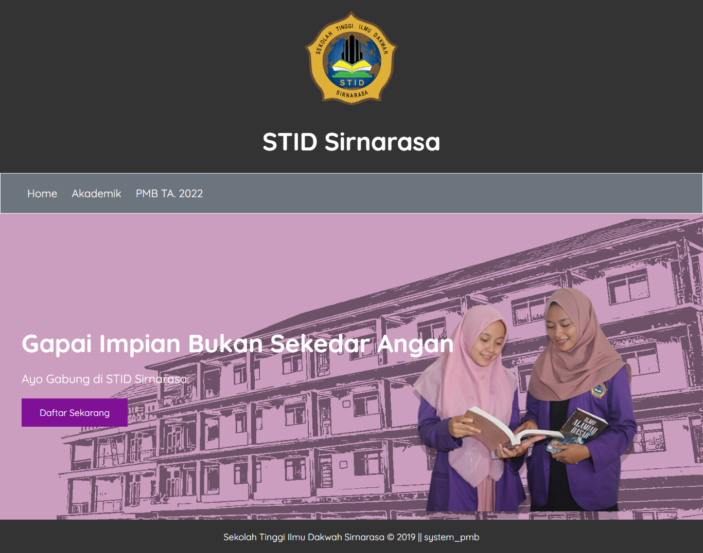

# system_pmb

This is my first web-based application. I made an application in 2019, as an exercise in making web-based applications using the PHP programming language and the MariaDB database and supported by a scripting language HTML-CSS. This project is named `Pendaftaran Mahasiswa Baru ( PMB )` as an illustration for new student admissions.

## things to note

-   I am using `MariaDB v15.1` distribution 10.4.22 and `PHP v7.4.27` while developing this project. If you are a Windows operating system user, you can use `xampp v3.3.0` as an alternative.
-   Before running the project, make sure the required applications are installed on the computer. To avoid errors it is recommended to install the same version that I am using.

## do the installation

1. Here are the steps to do the installation :
   - Make sure `PHP` and `MariaDB` are installed.
   - Move the `system_pmb folder` to the `htdocs folder`, so that it can be read by the web server.
   - Create a new database, for example with the name `system_pmb`  
   - Import `backup.sql` to database `system_pmb`.
   - To connect PHP and MariaDB, please configure the connection file in the `controllers/connection.php` folder .
   - The installation process has been completed
2. If the above requirements are met, the project can be ensured to run.

## thumbnail 

